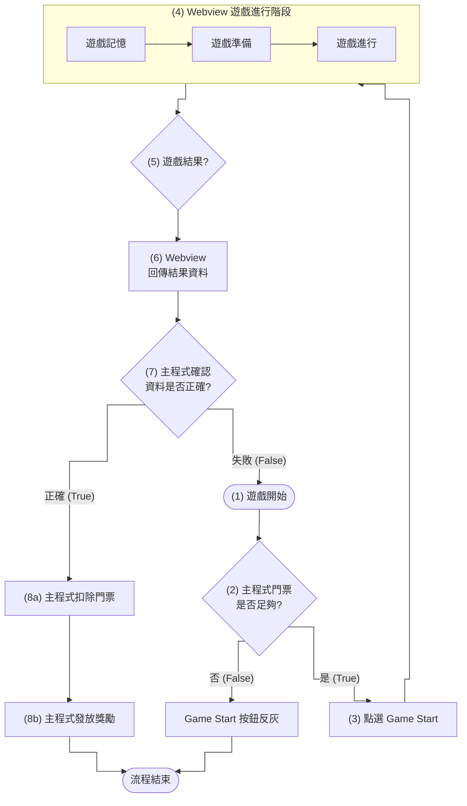

```mermaid
%%{init: {"flowchart": {"curve": "step"}}}%%
flowchart TD
    %% 使用雙引號 "" 包覆文字，這是最防呆的寫法
    Start(["(1) 遊戲開始"])
    CheckTicket{"(2) 主程式門票<br>是否足夠?"}
    BtnDisable["Game Start 按鈕反灰"]
    ClickStart["(3) 點選 Game Start"]
    
    Result{"(5) 遊戲結果?"}
    SendBack["(6) Webview<br>回傳結果資料"]
    CheckData{"(7) 主程式確認<br>資料是否正確?"}
    
    Deduct["(8a) 主程式扣除門票"]
    Reward["(8b) 主程式發放獎勵"]
    End(["流程結束"])

    %% 流程連線
    Start --> CheckTicket
    CheckTicket -- 否 (False) --> BtnDisable --> End
    CheckTicket -- 是 (True) --> ClickStart
    
    %% 遊戲進行子圖
    ClickStart --> GamePhase
    subgraph GamePhase ["(4) Webview 遊戲進行階段"]
        direction LR
        Mem["遊戲記憶"] --> Prep["遊戲準備"] --> Play["遊戲進行"]
    end
    
    GamePhase --> Result
    Result --> SendBack
    SendBack --> CheckData
    
    %% 關鍵分岔：確認資料是否正確
    CheckData -- 正確 (True) --> Deduct
    Deduct --> Reward
    Reward --> End
    CheckData -- 失敗 (False) --> Start
```
